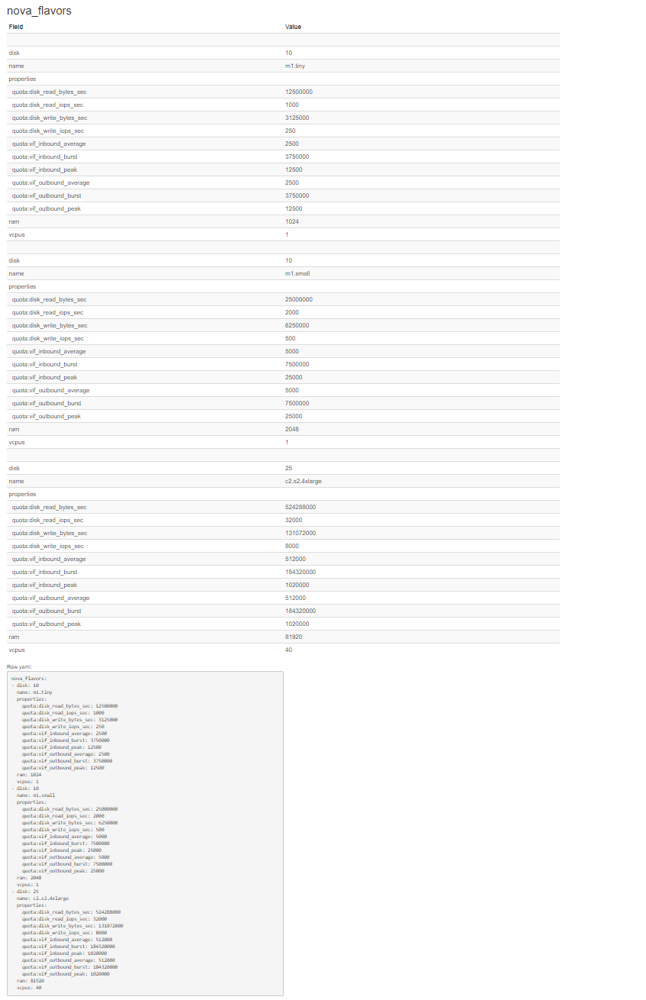

# Examples

## Intro
This program is helper tool for folks who need to document a YAML file. It will read YAML and generate tables out of 
each section of YAML"

It can generate a text table or a HTML table

Example :

Input YAML :
~~~~~~~~~~
metadata:
   name: nginx-deployment
    labels:
      app: nginx

Output Table :
~~~~~~~~~~~~
metadata:
+--------+------------------+
| Field  | Value            |
+--------+------------------+
| name   | nginx-deployment |
| labels | --               |
|   app  | nginx            |
+--------+------------------+


## Simple Example

Let's take an example of simple yaml file (i.e. samples/flavors.yaml as show below)

```yaml
---
nova_flavors:
  - disk: 10
    name: m1.tiny
    properties:
      quota:disk_read_bytes_sec: 12500000
      quota:disk_read_iops_sec: 1000
      quota:disk_write_bytes_sec: 3125000
      quota:disk_write_iops_sec: 250
      quota:vif_inbound_average: 2500
      quota:vif_inbound_burst: 3750000
      quota:vif_inbound_peak: 12500
      quota:vif_outbound_average: 2500
      quota:vif_outbound_burst: 3750000
      quota:vif_outbound_peak: 12500
    ram: 1024
    vcpus: 1
  - disk: 10
    name: m1.small
    properties:
      quota:disk_read_bytes_sec: 25000000
      quota:disk_read_iops_sec: 2000
      quota:disk_write_bytes_sec: 6250000
      quota:disk_write_iops_sec: 500
      quota:vif_inbound_average: 5000
      quota:vif_inbound_burst: 7500000
      quota:vif_inbound_peak: 25000
      quota:vif_outbound_average: 5000
      quota:vif_outbound_burst: 7500000
      quota:vif_outbound_peak: 25000
    ram: 2048
    vcpus: 1
  ...
  - disk: 25
    name: c2.s2.4xlarge
    properties:
      quota:disk_read_bytes_sec: 524288000
      quota:disk_read_iops_sec: 32000
      quota:disk_write_bytes_sec: 131072000
      quota:disk_write_iops_sec: 8000
      quota:vif_inbound_average: 512000
      quota:vif_inbound_burst: 184320000
      quota:vif_inbound_peak: 1020000
      quota:vif_outbound_average: 512000
      quota:vif_outbound_burst: 184320000
      quota:vif_outbound_peak: 1020000
    ram: 81920
    vcpus: 40
```

If you run script with this command:

```bash
python yaml_to_table.py --inputFile samples/flavors.yaml --out text
```

You will see output like this:

```bash
=> nova_flavors:
+------------------------------+---------------+
| Field                        | Value         |
+------------------------------+---------------+
|                              |               |
| disk                         | 10            |
| name                         | m1.tiny       |
| properties                   |               |
|   quota:disk_read_bytes_sec  | 12500000      |
|   quota:disk_read_iops_sec   | 1000          |
|   quota:disk_write_bytes_sec | 3125000       |
|   quota:disk_write_iops_sec  | 250           |
|   quota:vif_inbound_average  | 2500          |
|   quota:vif_inbound_burst    | 3750000       |
|   quota:vif_inbound_peak     | 12500         |
|   quota:vif_outbound_average | 2500          |
|   quota:vif_outbound_burst   | 3750000       |
|   quota:vif_outbound_peak    | 12500         |
| ram                          | 1024          |
| vcpus                        | 1             |
|                              |               |
| disk                         | 10            |
| name                         | m1.small      |
| properties                   |               |
|   quota:disk_read_bytes_sec  | 25000000      |
|   quota:disk_read_iops_sec   | 2000          |
|   quota:disk_write_bytes_sec | 6250000       |
|   quota:disk_write_iops_sec  | 500           |
|   quota:vif_inbound_average  | 5000          |
|   quota:vif_inbound_burst    | 7500000       |
|   quota:vif_inbound_peak     | 25000         |
|   quota:vif_outbound_average | 5000          |
|   quota:vif_outbound_burst   | 7500000       |
|   quota:vif_outbound_peak    | 25000         |
| ram                          | 2048          |
| vcpus                        | 1             |
|                              |               |
| disk                         | 25            |
| name                         | c2.s2.4xlarge |
| properties                   |               |
|   quota:disk_read_bytes_sec  | 524288000     |
|   quota:disk_read_iops_sec   | 32000         |
|   quota:disk_write_bytes_sec | 131072000     |
|   quota:disk_write_iops_sec  | 8000          |
|   quota:vif_inbound_average  | 512000        |
|   quota:vif_inbound_burst    | 184320000     |
|   quota:vif_inbound_peak     | 1020000       |
|   quota:vif_outbound_average | 512000        |
|   quota:vif_outbound_burst   | 184320000     |
|   quota:vif_outbound_peak    | 1020000       |
| ram                          | 81920         |
| vcpus                        | 40            |
+------------------------------+---------------+
Raw yaml:
        nova_flavors:
        - disk: 10
          name: m1.tiny
          properties:
            quota:disk_read_bytes_sec: 12500000
            quota:disk_read_iops_sec: 1000
            quota:disk_write_bytes_sec: 3125000
            quota:disk_write_iops_sec: 250
            quota:vif_inbound_average: 2500
            quota:vif_inbound_burst: 3750000
            quota:vif_inbound_peak: 12500
            quota:vif_outbound_average: 2500
            quota:vif_outbound_burst: 3750000
            quota:vif_outbound_peak: 12500
          ram: 1024
          vcpus: 1
        - disk: 10
          name: m1.small
          properties:
            quota:disk_read_bytes_sec: 25000000
            quota:disk_read_iops_sec: 2000
            quota:disk_write_bytes_sec: 6250000
            quota:disk_write_iops_sec: 500
            quota:vif_inbound_average: 5000
            quota:vif_inbound_burst: 7500000
            quota:vif_inbound_peak: 25000
            quota:vif_outbound_average: 5000
            quota:vif_outbound_burst: 7500000
            quota:vif_outbound_peak: 25000
          ram: 2048
          vcpus: 1
        - disk: 25
          name: c2.s2.4xlarge
          properties:
            quota:disk_read_bytes_sec: 524288000
            quota:disk_read_iops_sec: 32000
            quota:disk_write_bytes_sec: 131072000
            quota:disk_write_iops_sec: 8000
            quota:vif_inbound_average: 512000
            quota:vif_inbound_burst: 184320000
            quota:vif_inbound_peak: 1020000
            quota:vif_outbound_average: 512000
            quota:vif_outbound_burst: 184320000
            quota:vif_outbound_peak: 1020000
          ram: 81920
          vcpus: 40

```

If you need html as output then you can run it like this:

```bash
> python yaml_to_table.py --inputFile samples/flavors.yaml --out html
File samples/flavors.doc.html has been generated
```

Tool will generate output HTML file that will look like this :


