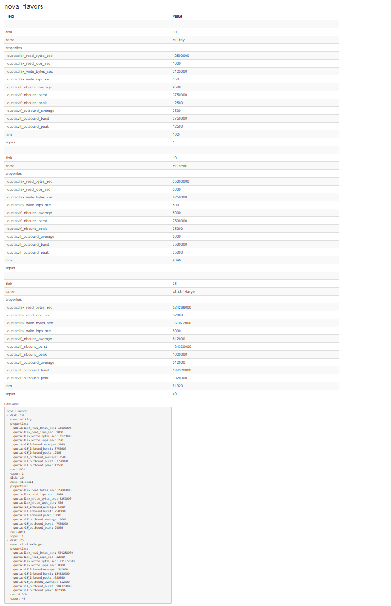

# yaml-to-table
Convert YAML file to text/html table for documentation 

# Introduction 
  Time to time I needed to document YAML files for end-users. And best way so far we have seen is to build
  table and put each field in table row and document it. 
  I need a quick script that will take YAML file and generated (html) table;
   only thing I needed to do was to input some help text that explains field
   
   Above need gave way to this python script; it will do just that - given input (yaml) file it will   
   it iterates over each yaml section and builds table(s) out of it 
   
   As of now it creates multiple tables based on top level YAML sections  
   
   This mainly uses two python libraries '*pyaml*' and '*prettyTable*' 
   
   [PrettyTable](https://pypi.org/project/PrettyTable/): For printing text tables or HTML table    
   [oyaml](https://github.com/wimglenn/oyaml) as it preserves order in python dictionary
   
# Usage

```bash
python3 -m venv venv
source venv/Scripts/activate
pip install -r requirements.txt
```

```bash
> python yaml_to_table.py -h
usage: yaml_to_table.py [-h] --inputFile INPUTFILE [--out {txt,html,text}]

YAML file to (HTML) table converter

optional arguments:
  -h, --help            show this help message and exit
  --inputFile INPUTFILE
                        input yaml file to process
  --out {txt,html,text}
                        convert yaml to text table or html table

text table will be printed as STDOUT - html table will be save in html file
```

# Sample 

Let's take an example of simple yaml file (i.e. samples/flavors.yaml as show below)

```yaml
---
nova_flavors:
  - disk: 10
    name: m1.tiny
    properties:
      quota:disk_read_bytes_sec: 12500000
      quota:disk_read_iops_sec: 1000
      quota:disk_write_bytes_sec: 3125000
      quota:disk_write_iops_sec: 250
      quota:vif_inbound_average: 2500
      quota:vif_inbound_burst: 3750000
      quota:vif_inbound_peak: 12500
      quota:vif_outbound_average: 2500
      quota:vif_outbound_burst: 3750000
      quota:vif_outbound_peak: 12500
    ram: 1024
    vcpus: 1
  - disk: 10
    name: m1.small
    properties:
      quota:disk_read_bytes_sec: 25000000
      quota:disk_read_iops_sec: 2000
      quota:disk_write_bytes_sec: 6250000
      quota:disk_write_iops_sec: 500
      quota:vif_inbound_average: 5000
      quota:vif_inbound_burst: 7500000
      quota:vif_inbound_peak: 25000
      quota:vif_outbound_average: 5000
      quota:vif_outbound_burst: 7500000
      quota:vif_outbound_peak: 25000
    ram: 2048
    vcpus: 1
  ...
  - disk: 25
    name: c2.s2.4xlarge
    properties:
      quota:disk_read_bytes_sec: 524288000
      quota:disk_read_iops_sec: 32000
      quota:disk_write_bytes_sec: 131072000
      quota:disk_write_iops_sec: 8000
      quota:vif_inbound_average: 512000
      quota:vif_inbound_burst: 184320000
      quota:vif_inbound_peak: 1020000
      quota:vif_outbound_average: 512000
      quota:vif_outbound_burst: 184320000
      quota:vif_outbound_peak: 1020000
    ram: 81920
    vcpus: 40
```

If you run script with this command:

```bash
python yaml_to_table.py --inputFile samples/flavors.yaml --out text
```

You will see output like this:

```bash
=> nova_flavors:
+------------------------------+---------------+
| Field                        | Value         |
+------------------------------+---------------+
|                              |               |
| disk                         | 10            |
| name                         | m1.tiny       |
| properties                   |               |
|   quota:disk_read_bytes_sec  | 12500000      |
|   quota:disk_read_iops_sec   | 1000          |
|   quota:disk_write_bytes_sec | 3125000       |
|   quota:disk_write_iops_sec  | 250           |
|   quota:vif_inbound_average  | 2500          |
|   quota:vif_inbound_burst    | 3750000       |
|   quota:vif_inbound_peak     | 12500         |
|   quota:vif_outbound_average | 2500          |
|   quota:vif_outbound_burst   | 3750000       |
|   quota:vif_outbound_peak    | 12500         |
| ram                          | 1024          |
| vcpus                        | 1             |
|                              |               |
| disk                         | 10            |
| name                         | m1.small      |
| properties                   |               |
|   quota:disk_read_bytes_sec  | 25000000      |
|   quota:disk_read_iops_sec   | 2000          |
|   quota:disk_write_bytes_sec | 6250000       |
|   quota:disk_write_iops_sec  | 500           |
|   quota:vif_inbound_average  | 5000          |
|   quota:vif_inbound_burst    | 7500000       |
|   quota:vif_inbound_peak     | 25000         |
|   quota:vif_outbound_average | 5000          |
|   quota:vif_outbound_burst   | 7500000       |
|   quota:vif_outbound_peak    | 25000         |
| ram                          | 2048          |
| vcpus                        | 1             |
|                              |               |
| disk                         | 25            |
| name                         | c2.s2.4xlarge |
| properties                   |               |
|   quota:disk_read_bytes_sec  | 524288000     |
|   quota:disk_read_iops_sec   | 32000         |
|   quota:disk_write_bytes_sec | 131072000     |
|   quota:disk_write_iops_sec  | 8000          |
|   quota:vif_inbound_average  | 512000        |
|   quota:vif_inbound_burst    | 184320000     |
|   quota:vif_inbound_peak     | 1020000       |
|   quota:vif_outbound_average | 512000        |
|   quota:vif_outbound_burst   | 184320000     |
|   quota:vif_outbound_peak    | 1020000       |
| ram                          | 81920         |
| vcpus                        | 40            |
+------------------------------+---------------+
Raw yaml:
        nova_flavors:
        - disk: 10
          name: m1.tiny
          properties:
            quota:disk_read_bytes_sec: 12500000
            quota:disk_read_iops_sec: 1000
            quota:disk_write_bytes_sec: 3125000
            quota:disk_write_iops_sec: 250
            quota:vif_inbound_average: 2500
            quota:vif_inbound_burst: 3750000
            quota:vif_inbound_peak: 12500
            quota:vif_outbound_average: 2500
            quota:vif_outbound_burst: 3750000
            quota:vif_outbound_peak: 12500
          ram: 1024
          vcpus: 1
        - disk: 10
          name: m1.small
          properties:
            quota:disk_read_bytes_sec: 25000000
            quota:disk_read_iops_sec: 2000
            quota:disk_write_bytes_sec: 6250000
            quota:disk_write_iops_sec: 500
            quota:vif_inbound_average: 5000
            quota:vif_inbound_burst: 7500000
            quota:vif_inbound_peak: 25000
            quota:vif_outbound_average: 5000
            quota:vif_outbound_burst: 7500000
            quota:vif_outbound_peak: 25000
          ram: 2048
          vcpus: 1
        - disk: 25
          name: c2.s2.4xlarge
          properties:
            quota:disk_read_bytes_sec: 524288000
            quota:disk_read_iops_sec: 32000
            quota:disk_write_bytes_sec: 131072000
            quota:disk_write_iops_sec: 8000
            quota:vif_inbound_average: 512000
            quota:vif_inbound_burst: 184320000
            quota:vif_inbound_peak: 1020000
            quota:vif_outbound_average: 512000
            quota:vif_outbound_burst: 184320000
            quota:vif_outbound_peak: 1020000
          ram: 81920
          vcpus: 40

```

If you need html as output then you can run it like this:

```bash
> python yaml_to_table.py --inputFile samples/flavors.yaml --out html
File samples/flavors.doc.html has been generated
```

Tool will generate output HTML file that will look like this :


